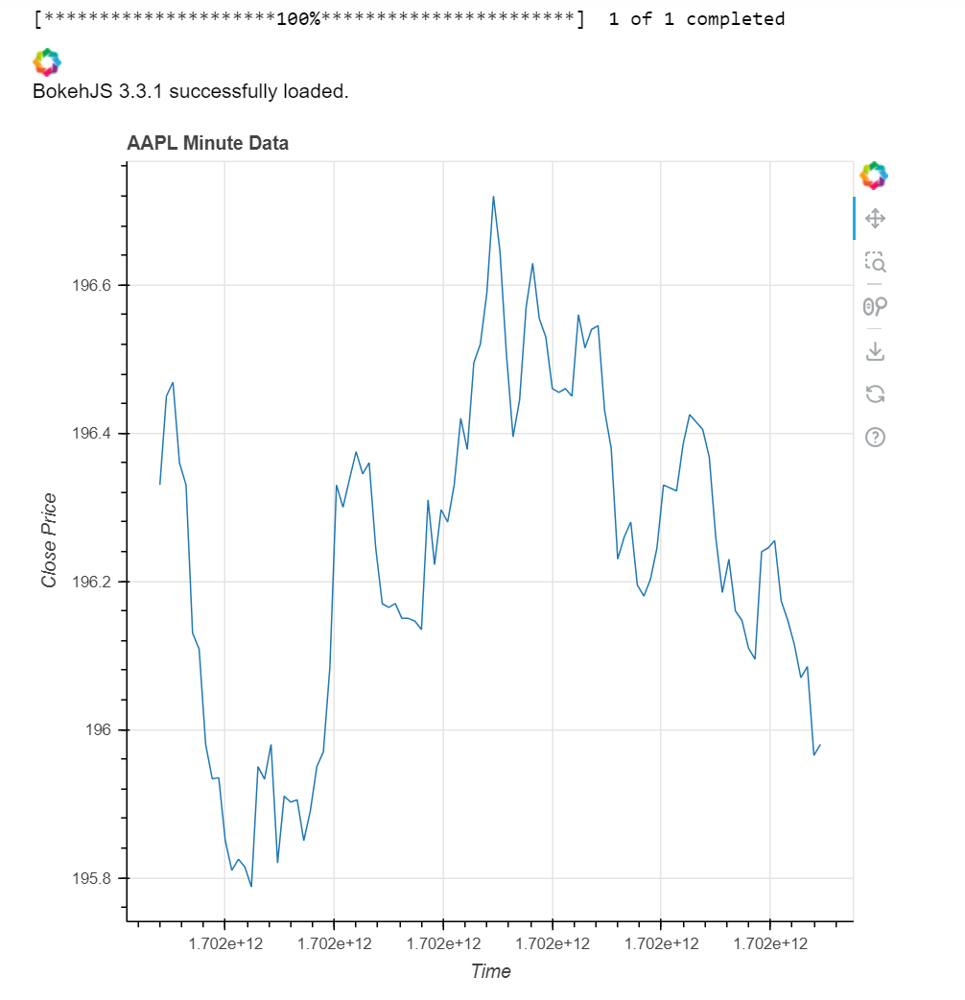

# Real-Time Stock Data Visualization with Streamz and Bokeh
Real-time Stock Visualization with Streamz and Bokeh: Visualize minute-level stock data in real-time using Streamz and Bokeh. Fetch stock information from Yahoo Finance, stream it to a dynamic Bokeh plot in a Jupyter notebook, and gain insights into stock price movements.

## Overview

This repository contains a Python script for real-time stock data visualization using Streamz and Bokeh. The script fetches minute-level stock data from Yahoo Finance using the yfinance library and streams the data to a Bokeh plot in a Jupyter notebook.



## Dependencies
yfinance: Fetches minute-level stock data from Yahoo Finance.
streamz: Provides the stream for real-time data updates.
bokeh: Used for creating interactive and real-time plots.

## Configuration
Set the start and end dates in the script (start_date and end_date variables). For 1min data from Yahoo Finance, make sure that the start and end dates are the past 7 days. 
Define the ticker symbol for the desired stock (ticker_symbol variable).

## Issues and Contributions
Feel free to open issues for any bugs, improvements, or feature requests. Contributions are welcome through pull requests.

## License
This project is licensed under the MIT License.

## Prerequisites

Before running the script, make sure you have the required libraries installed:

```bash
pip install streamz bokeh yfinance

